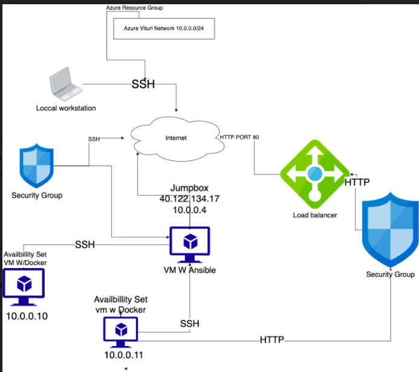
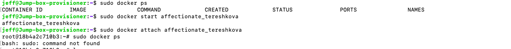

## Automated ELK Stack Deployment

The files in this repository were used to configure the network depicted below.

Heres the Breakdown proces. 

These files have been tested and used to generate a live ELK deployment on Azure. They can be used to either recreate the entire deployment pictured above. Alternatively, select portions of the file may be used to install only certain pieces of it, such as Filebeat.

 
[Elk-playnook.yml install unit](elk-playbook.yml)

This document contains the following details:
- Description of the Topology
- Access Policies
- ELK Configuration
- Beats in Use
- Machines Being Monitored
- How to Use the Ansible Build

### Description of the Topology

The main purpose of this network is to expose a load-balanced and monitored instance of DVWA, the D*mn Vulnerable Web Application.

Load balancing ensures that the application will be highly accessible in addition to restricting  reliability through to the network.
 
A stable load balancers protects - The Web Application Firwall (WAF) this layer of protection keeps the website in top notch shape. The Jump-box can still provive service if ports are falling each other.

Integrating an ELK server allows users to easily monitor the vulnerable VMs for changes to the logs and system traffic.

What does Filebeat watch - Filebeat reviews data logs then sends it to the correct output. unit.
What does Metricbeat record - Metricbeat collects up content on server, then take metrics from the operating system to out configuration.

The configuration details of each machine may be found below.

| Name     | Function | IP Address | Operating System |
|----------|----------|------------|------------------|
| Jump-Box | Gateway  | 10.0.0.4   | Linux            |
| WEB  1   | Server   | 10.0.0.10  | Linux            |
| WEB  2   | Server   | 10.0.0.11  | Linux            |
| ELK VM   |Monitoring| 10.1.0.4   | Linux            |

### Access Policies

The machines on the internal network are not exposed to the public Internet.
The Jump-box machine can accept connections from the Internet. Access to this machine is only allowed from the following IP addresses 

SSH port 22 

Machines within the network can only be accessed by Jump-Box-Provisioner.
Which machine did you allow to access your ELK VM - Jump-Box-Provisioner.

Private IP address  - 10.0.0.4

A summary of the access policies in place can be found in the table below.

| Name     | Publicly Accessible | Allowed IP Addresses |
|----------|---------------------|----------------------|
| Jump Box | Yes                 | 40.122.134.17/10.0.04|
| Web-1    | No                  | 10.0.0.4             |
| Web-2    | No                  | 10.0.0.4             |
| Elk VM   | No                  | 10.0.0.4             |
 
### Elk Configuration

Ansible was used to automate configuration of the ELK machine. No configuration was performed manually, which is advantageous because...

What is the main advantage of automating configuration with Ansible?_

The playbook implements the following tasks:
Install docker.io 
Install pip3
Install Docker python module

The following screenshot displays the result of running `docker ps` after successfully configuring the ELK instance.

### Target Machines & Beats
This ELK server is configured to monitor the following machines:

Webserver 1 10.0.0.10

Webserver 2 10.0.0.11

We have installed Metricbeat and filebeat these machines:

These Beats allow us to collect the following information from each machine:

Metricbeat collects up content on server, then take metrics from the operating system to out configuration.

Filebeat reviews data logs then sends it to the correct output. unit.

### Using the Playbook
In order to use the playbook, you will need to have an Ansible control node already configured. Assuming you have such a control node provisioned: 

SSH into the control node and follow the steps below:

-Copy the Playbook file to Ansible.

-Update the host file to include both webserver and ELK.

-Run the playbook, and navigate to Kibana to check that the installation worked as expected.

_TODO: Answer the following questions to fill in the blanks:_
- _Which file is the playbook? Where do you copy it?_
- _Which file do you update to make Ansible run the playbook on a specific machine? How do I specify which machine to install the ELK server on versus which to install Filebeat on?_
- _Which URL do you navigate to in order to check that the ELK server is running?

_As a **Bonus**, provide the specific commands the user will need to run to download the playbook, update the files, etc._
